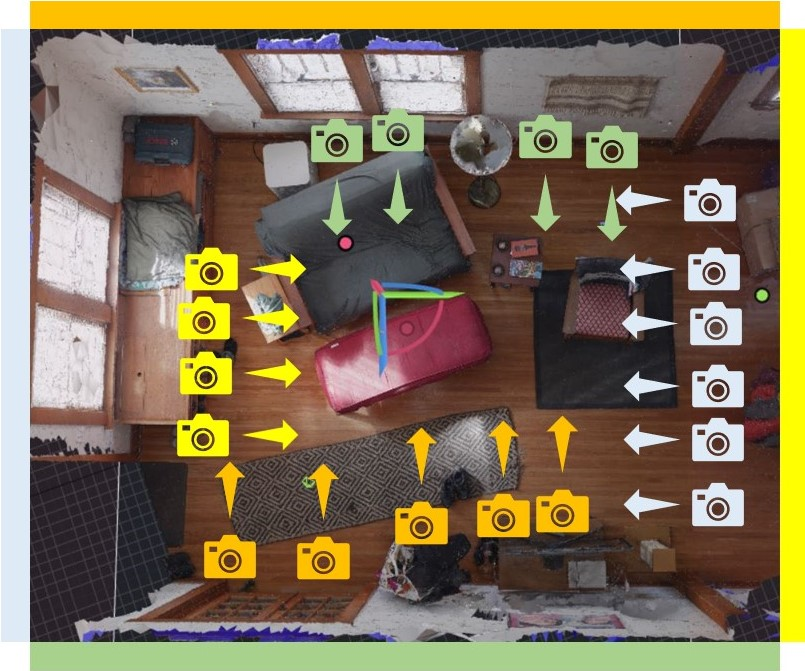

# Activities

## Photogrammetry:

- Cameras:
  - After searching the Internet for which cameras to use for photogrammetry, the consensus seems to be on a **DSLR camera**. The DSLR camera will give you better resolution, sharpness and clarity because it uses a larger sensor than other cameras. The best DSLR cameras on the market are Canon or Nikon.

- Camera Lens:
  - People suggest using an approximately **28mm or 24mm (35mm equivalent) prime lens** for capturing photos of rooms and interiors. Typically lens of 50mm focal length (35mm equivalent) are used to photograph smaller objects. Lens below 22mm are not recommended.
  
- Image Capturing Process:
  - Camera Settings:
    - lowest ISO setting for minimal noise (Ideal ISO settings are in the range of 250 to 320)
    - keep your f/stop settings around f/8 to f/16 for best results or set your f/stop so the entire frame is in focus
    - use the manual setting or aperature priority or use the camera's sharpest aperature at your chosen widest fixed focal length
    - RAW image files are best
  - Tripod:
    - typically using a tripod (possibly with a remote) improves stability and reduce bluriness
    - tripods are also good when ambient lighting is low
    - when using a **tripod**, you can set a very slow shutter, ideal for revealing surfaces in darker environments
    - when shooting **handheld**, you can set a higher shutter speed of at least 1/200 or faster (or slower if you’re steady with the camera)
  - Best Practices:
    - avoid capturing mirror-like or reflective surfaces, featureless white walls, glass
    - do your photography when the sun is highest in the sky or on an overcast day to minimize shadow
    - work as quickly as possible to capture your photoset to minimize shadow movement
  - How to Shoot:
    - [Photographing our environment for reality capture](https://www.youtube.com/watch?v=efeWrgtjMg8)
    - 
    
 - Software
  -to be continued...
  
# Issues

[Any roadblocks you have encountered or issues that you want to discuss.  Please include as many details as possible.]

# Plans

[Plans for next week (and beyond, as appropriate).]

# Main Website Sources

- [What Camera Should You Use for Photogrammetry](https://medium.com/@EightyLevel/what-camera-should-you-use-for-photogrammetry-3a67864bd4eb)
- [A Guide to Photogrammetry Photography](https://journalists.org/resources/a-guide-to-photogrammetry-photography/)
- [Reality Capture: best practices for shooting great environments](https://area.autodesk.com/blogs/journey-to-vr/reality-capture-a-roundup-of-best-photogrammetry-practices-for-shooting-great-environments/)
- [Arc/k Project Photogrammetry](https://arck-project.org/photogrammetry/)
