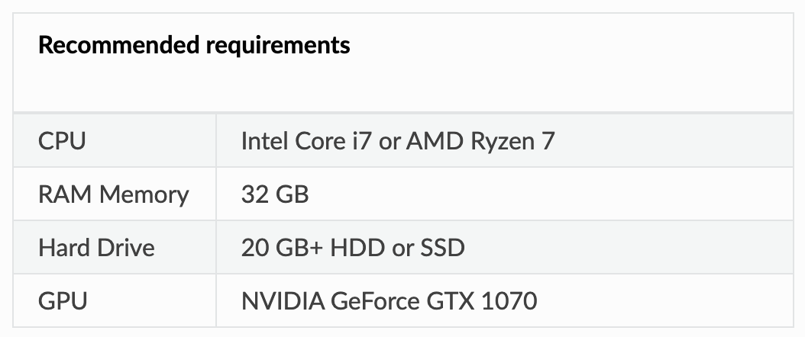

# Activities

## Photogrammetry:

- Equipment:
  - **Camera**:
    - During my search for the best camera for photogrammetry, the best camera type appeared to be DSLR or Mirrorless cameras. When narrowing down my search, I found that the Nikkon D3500 and the Canon EOS Rebel SL2 or SL3 were the most popular DSLR and for photogrammetry. Due to the differences in prices and similar quality, the camera selected is the Nikon D3500, which is a both affordable, good quality, and works well for beginners.
      - Nikon D3500 and Parts:
         - [Walmart Camera w/ Lens $539.95](https://www.walmart.com/ip/Nikon-D3500-W-AF-P-DX-NIKKOR-18-55mm-f-3-5-5-6G-VR-Black/486922359)
        - [Best Buy Camera w/ Lens $599.95](https://www.bestbuy.com/site/nikon-d3500-dslr-video-camera-with-af-p-dx-nikkor-18-55mm-f-3-5-5-6g-vr-lens-black/6296213.p?skuId=6296213)
        - [Amazon 65" Camera Tripod $29.99](https://www.amazon.com/Compact-Weight-Travel-Portable-Aluminum/dp/B00L1V0HF0/ref=sr_1_6?dchild=1&keywords=Nikon+D3500&qid=1612550938&s=photo&sr=1-6)
      - Nikon D3500 Bundle:
        - [Amazon Camera w/ Bundle $629.00](https://www.amazon.com/Nikon-D3500-Camera-18-55mm-Kit/dp/B08L41WQCC/ref=sr_1_5?crid=3EKSZOD7ZOWMH&dchild=1&keywords=nikon+d3500&qid=1612551798&s=electronics&sprefix=nikon%2Celectronics%2C264&sr=1-5) (Includes a lens, tripod, case, 64GB SD card, cleaning cloth, etc)
        - [Walmart Camera w/ Full Kit $639.00](https://www.walmart.com/ip/Nikon-D3500-DSLR-Camera-with-18-55mm-VR-Lens-32GB-Card-Tripod-Case-and-More-18pc-Bundle/168666425?wmlspartner=wlpa&selectedSellerId=5323) (Includes a lens, tripod, case, 32GB SD card, cleaning cloth, etc) 
   - After looking for the best parts, kits, and prices on the market, it appears that buying the **Walmart camera w/ lens and the Amazon tripod** is the best option for a total of approx. $570. The additional supplies that are provided in the kits can be purchased independently if necessary.
      
    
- Software
  - Now that I am aware that I can use any operating system for this project, I am reavaluating which Photogrammetry software is ideal for this project. After reviewing my sources, the top quality software are:
    - AliceVision Meshroom (OS: Windows, Linux; Price: Free)
    - COLMAP (OS: MacOS, Windows, Linux; Price: Free)
    - Agisoft Metashape (OS: MacOS, Windows, Linux ; Price: $59)
  - Upon reading reviews and articles on these software, there is a consensus around using **[Meshroom](https://alicevision.org/#meshroom)** for photogrammetry projects, as the open-source software is easy to use, free and has a very intuitive interface. Agisoft Metashape may produce slightly higher quality results, but it is more compelex and costly.
  - For Meshroom, there are recommended computer hardware requirements.
    - 

# Future Plans

- Purchase camera equipment
- Research more Meshroom specific photogrammetry techniques
- Gain access to a Windows or Linux computer with the components above

# Main Sources

- Cameras
  - [Low-Cost Camera for Photogrammetry](https://www.photomodeler.com/low-cost-cameras-for-photogrammetry/)
  - [The Best DSLR Camera in 2021 (Digital Camera World)](https://www.digitalcameraworld.com/buying-guides/best-dslr-camera)
  - [The Best DSLR Camera 2021 (TechRadar)](https://www.techradar.com/news/best-dslr)
- Software
  - [Best Photogrammetry Software](https://all3dp.com/1/best-photogrammetry-software/)
  - [The Top 10 Best Photogrammetry Software 2021](https://3dsourced.com/3d-software/best-photogrammetry-software/)
  - [Free and Commercial Photogrammetry Software Review 2020](https://peterfalkingham.com/2020/07/10/free-and-commercial-photogrammetry-software-review-2020/)
  - [To 3D or Not 3D: Choosing a Photogrammetry Workflow for Cultural Heritage Groups](https://core.ac.uk/download/pdf/220107531.pdf)
  - [Photogrammetric reconstruction software as a cost-efficient support tool in conservation research](/Spring2021-Reports/2021-02-09/Photogrammetric_research.pdf)
