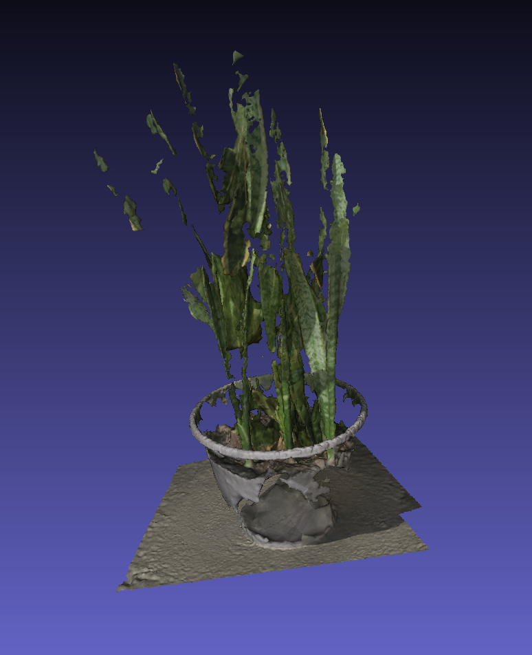

# Activities

## Photogrammetry:

- Created photogrammetric model of two items using command-line Meshroom.
  - photos taken can be found [here](https://github.com/evelynhasama/meshroomTesting)
  - bicycle: 
    -  command: ~/.local/Meshroom-2020.1.0/meshroom_photogrammetry --cache $HOME/cache --input meshroom/meshroomTesting/bicycle/ --output models_bicycle
    -  number images: 119
    -  dimensions: 3024 × 4032 
    -  exposure: f/1.8
    -  exposure time: 1/3,521
    -  focal length: 4.25 mm
    -  time to create the model: approx 1 hour 10 minutes
  - snake plant: 
    -  command: ~/.local/Meshroom-2020.1.0/meshroom_photogrammetry --cache $HOME/cache --input meshroom/meshroomTesting/snake_plant/ --output models_snake_plant
    -  number images: 54
    -  dimensions: 3024 × 4032 
    -  exposure: f/1.8
    -  exposure time: 1/3,521
    -  focal length: 4.25 mm
    -  time to create the model: approx 20 to 30 minutes
         
- Used Meshlab to remove unwanted vertices from the models.
  - bicycle
    - 
    - 
  - snake plant
    - 
    - 

# Future Plans

- learn how to improve the quality of Meshroom models
- learn how to clean up models more with Meshlab

